# eJiangnan(parody)

基于springboot和vue3的前后端分离项目

## GITHUB地址

[GITHUB地址](https://github.com/tinsyding/ejiangnan)

## 功能

1. **管理员**

    - [x] 登录
    - [x] 个人资料管理
    - [x] 文件管理
    - [x] 课程管理
    - [x] 学生管理
    - [x] 学生选课管理
    - [ ] ~~论坛管理~~

2. **用户**

    - [x] 登录
    - [x] 注册
    - [x] 找回密码
    - [x] 个人资料管理
    - [x] 查看文件
    - [x] 选课 
    - [ ] ~~论坛~~


## 技术栈

- SpringBoot2
- vue3
- Mybatis
- Element-ui
- MySQL

## 项目依赖

- Node.js (npm 10.2.3)
- Apache Maven 3.6.3

## 开发工具

- IntelliJ IDEA (JDK 21)
- WebStorm
- Navicat 16 (MySQL 8.2.0)
- postman (Debug)
- ~~Visual Studio Code~~

## 项目结构

    ├─springboot
    │  └─src
    │      └─main
    │          ├─java
    │          │  └─com
    │          │      └─example
    │          │          ├─common
    │          │          ├─controller
    │          │          ├─entity
    │          │          ├─exception
    │          │          ├─mapper
    │          │          └─service
    │          └─resources
    │              └─mapper
    └─vue
        ├─public
        └─src
            ├─css
            ├─images
            ├─router
            ├─utils
            └─web

##  项目运行

1. **数据库**

    1. 创建数据库

        ```sql
        CREATE DATABASE ejiangnan;
        ```

    2. 创建一个mysql账户，确保该账户有对ejiangnan数据库的所有权限

        ```sql
        CREATE USER '你的数据库用户名'@'localhost' IDENTIFIED BY '你的数据库密码';
        GRANT ALL PRIVILEGES ON ejiangnan.* TO '你的数据库用户名'@'localhost';
        FLUSH PRIVILEGES;
        ```

    3. 导入数据库

        将`SQL\MySQL\eJiangnan.sql`导入ejiangnan数据库

    4. 在admin表中插入一条初始管理员账户

        **请注意：admin表中，role的值应为`ADMIN`**
        **请注意：student表中，role的值应为`STUDENT`**
    
        ```sql
        -- 创建一个学号/工号为admin、密码为admin、姓名为admin_name的管理员用户
        INSERT INTO `admin` VALUES (1, 'admin', 'admin', 'admin_name', 'ADMIN');
        ```
    
    5. 修改数据库配置

         打开`springboot\src\main\resources\application.yml`，修改数据库配置

         ```yaml
         spring:
           datasource:
             driver-class-name: com.mysql.cj.jdbc.Driver
             url: jdbc:mysql://localhost:3306/ejiangnan?useUnicode=true&characterEncoding=utf-8&serverTimezone=Asia/Shanghai
             username: 你的数据库用户名
             password: 你的数据库密码
         ```

2. **后端**

   - 进入项目根目录，打开命令行工具，输入以下命令：

        ```bash
        cd springboot
        mvn spring-boot:run
        ```

3. **前端**

   - 进入项目根目录，打开命令行工具，输入以下命令：

        ```bash
        cd vue
        npm install
        npm run dev
        ```

## 项目截图

- **登录页面**

  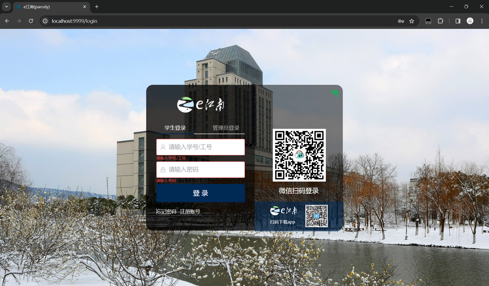

- **注册页面**

  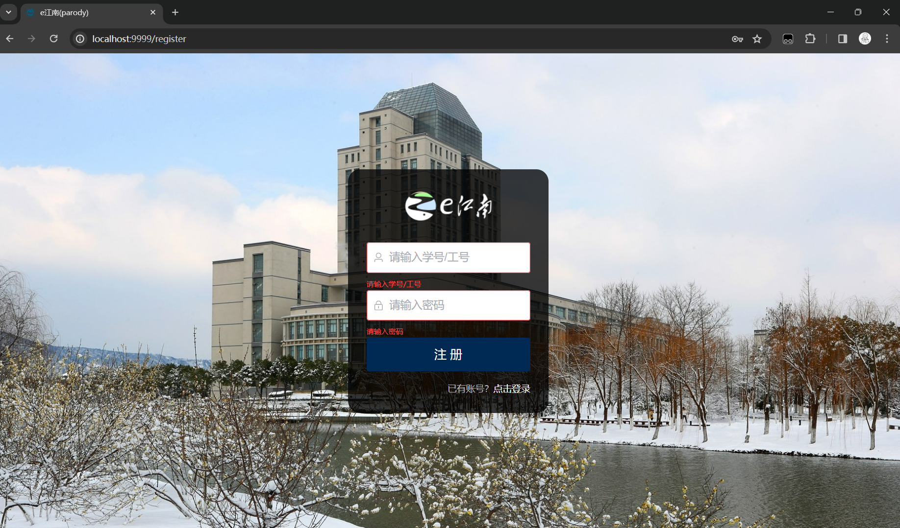

- **找回密码页面**

  

- **管理员对文件信息进行增删改查**

  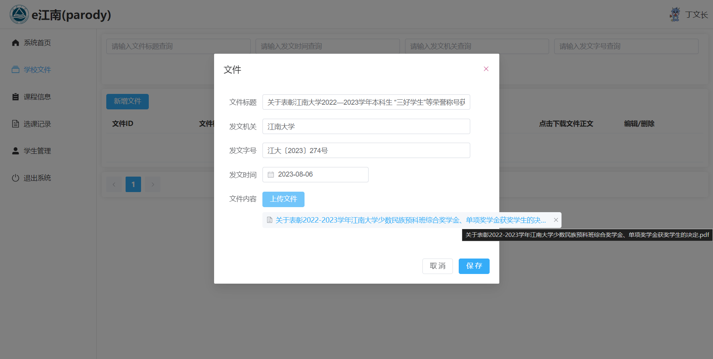

  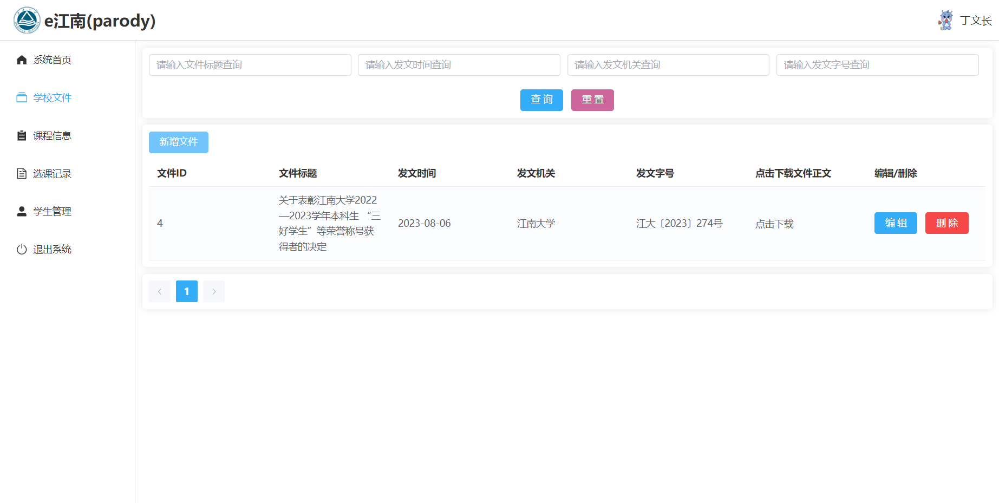

- **管理员对课程信息进行增删改查**

  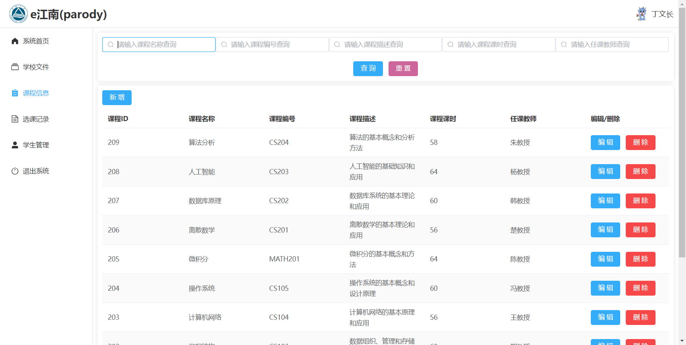

- **管理员对学生信息进行增删改查**

  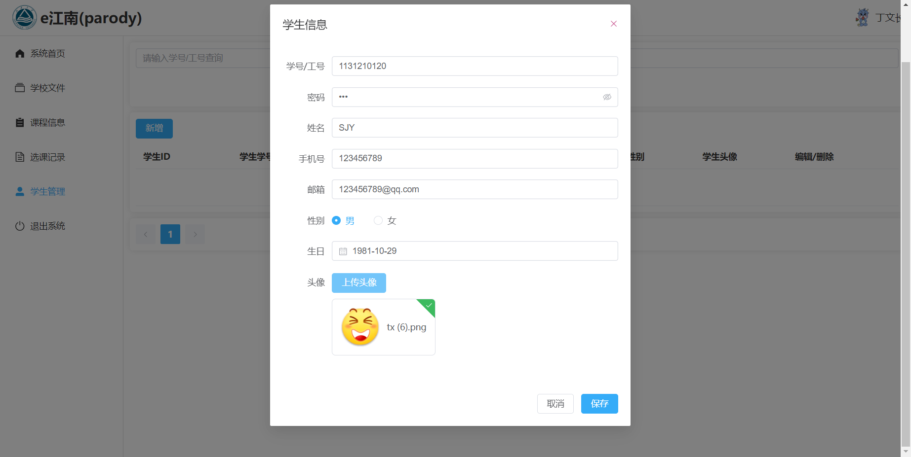

  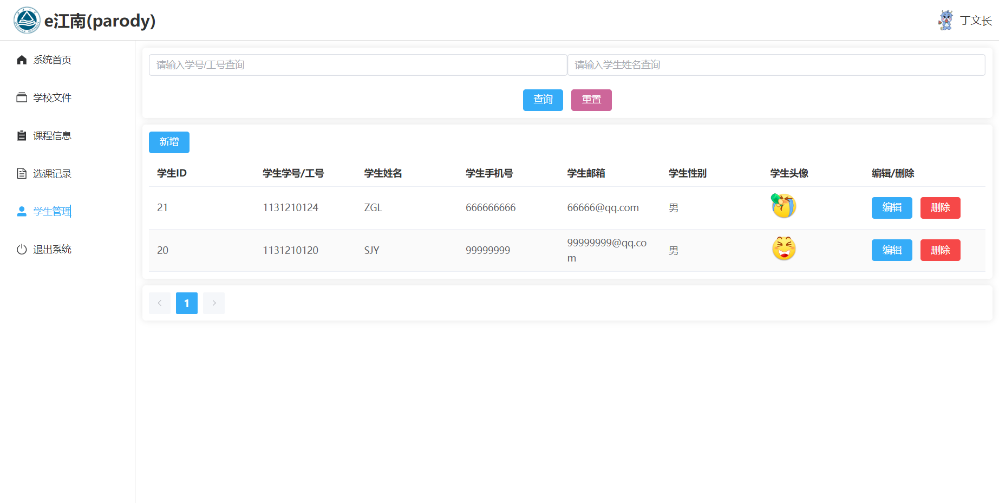

- **管理员对学生选课情况进行查看、删除**

  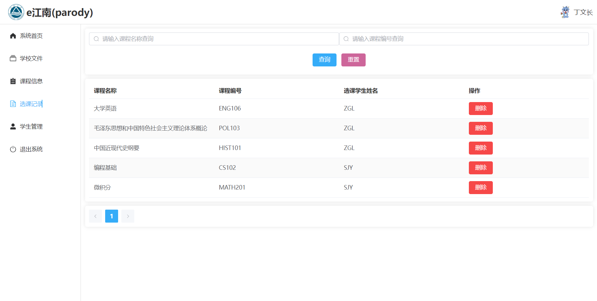

- **用户个人资料页**

  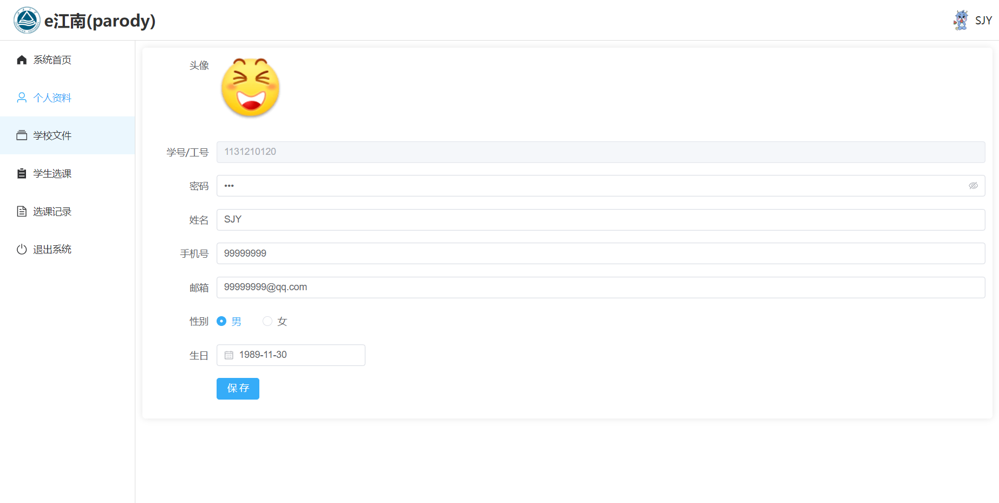

- **用户查看、下载文件**
  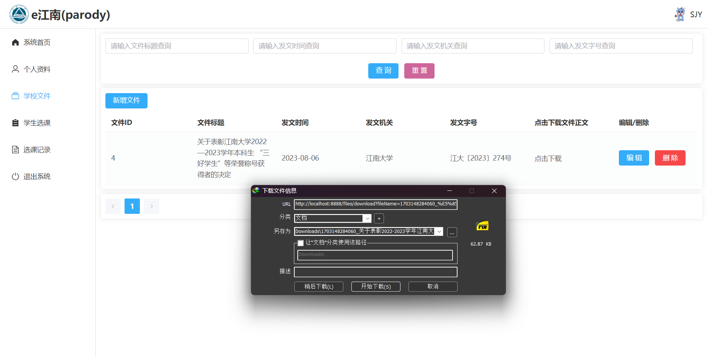

- **用户选课**

  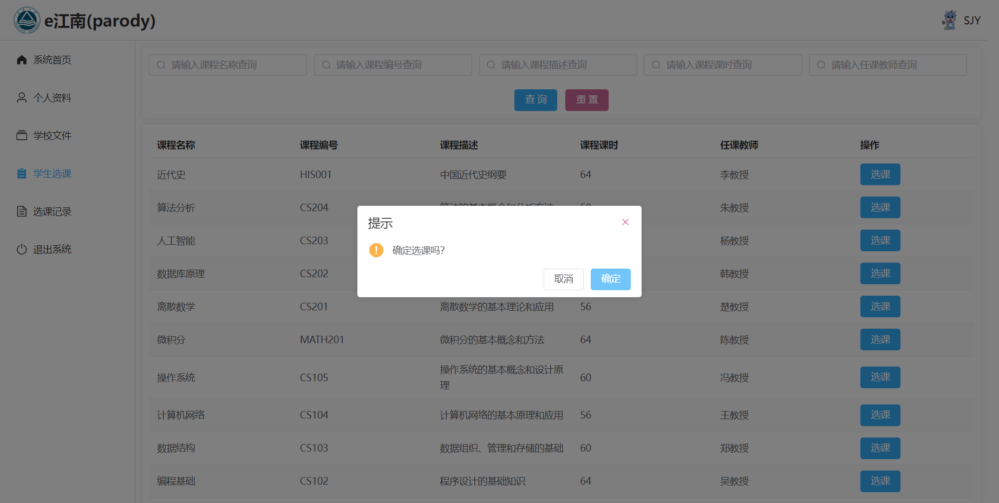

- **用户查看个人选课情况**

  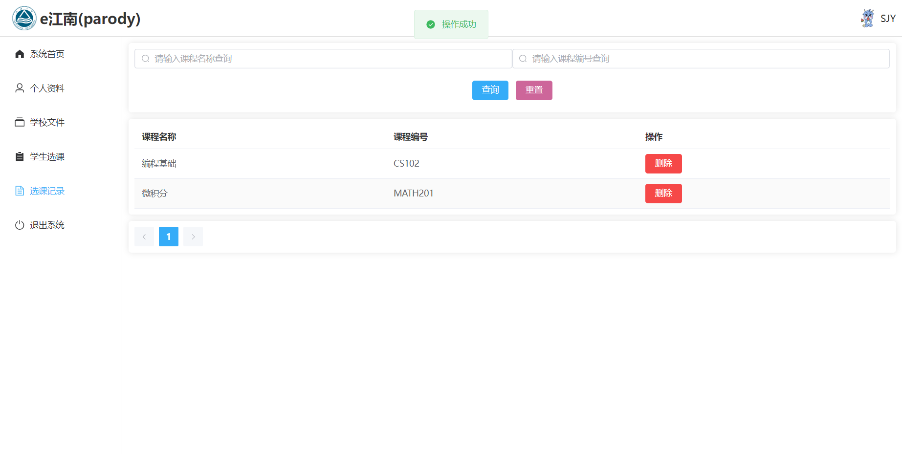
